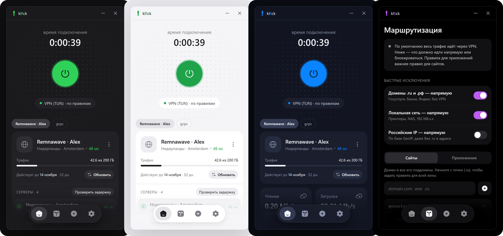
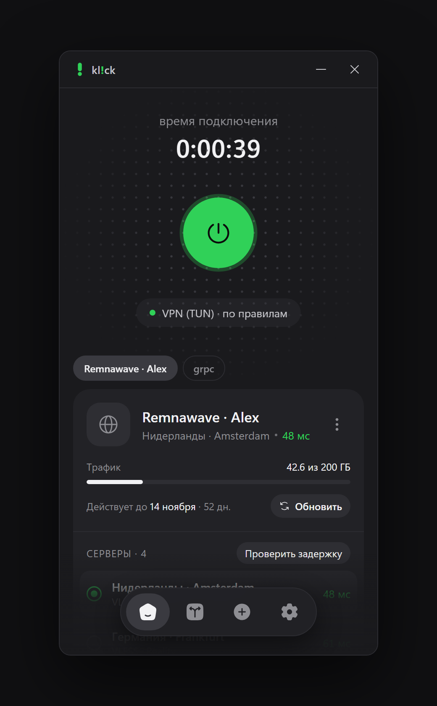
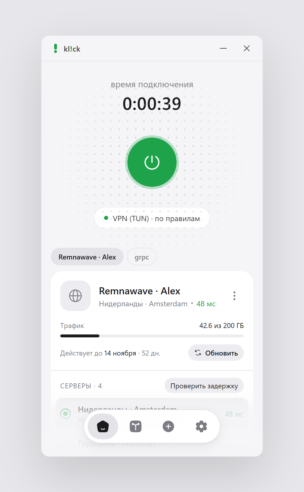
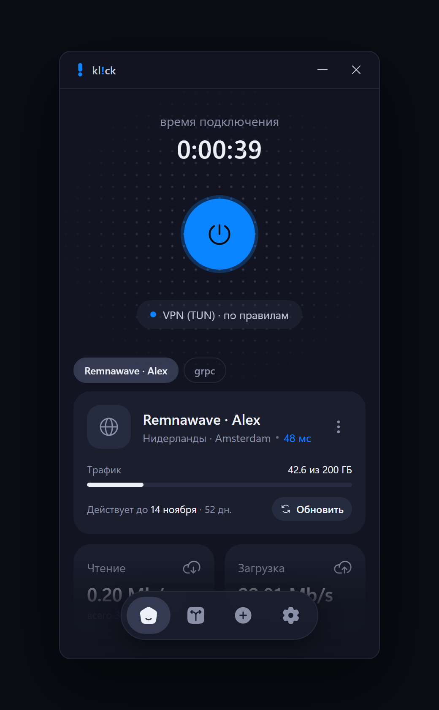
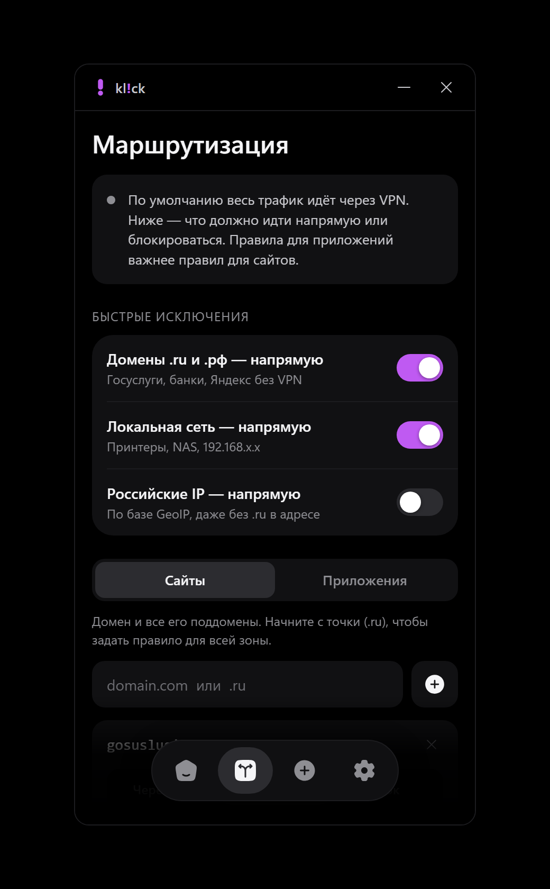
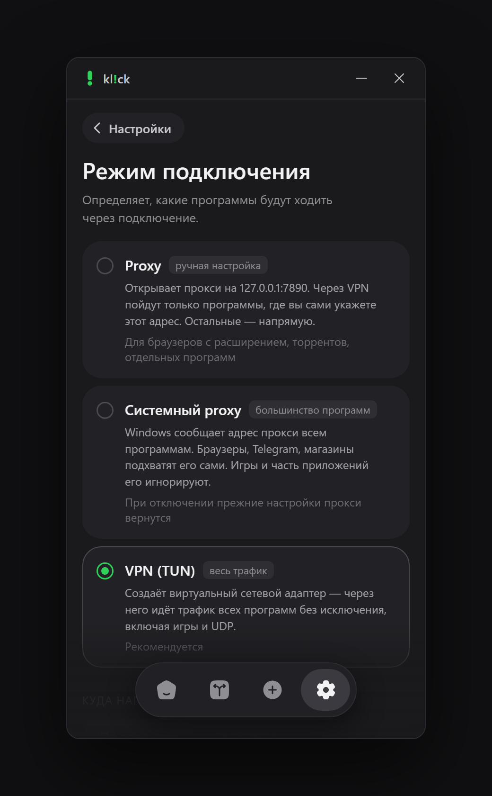
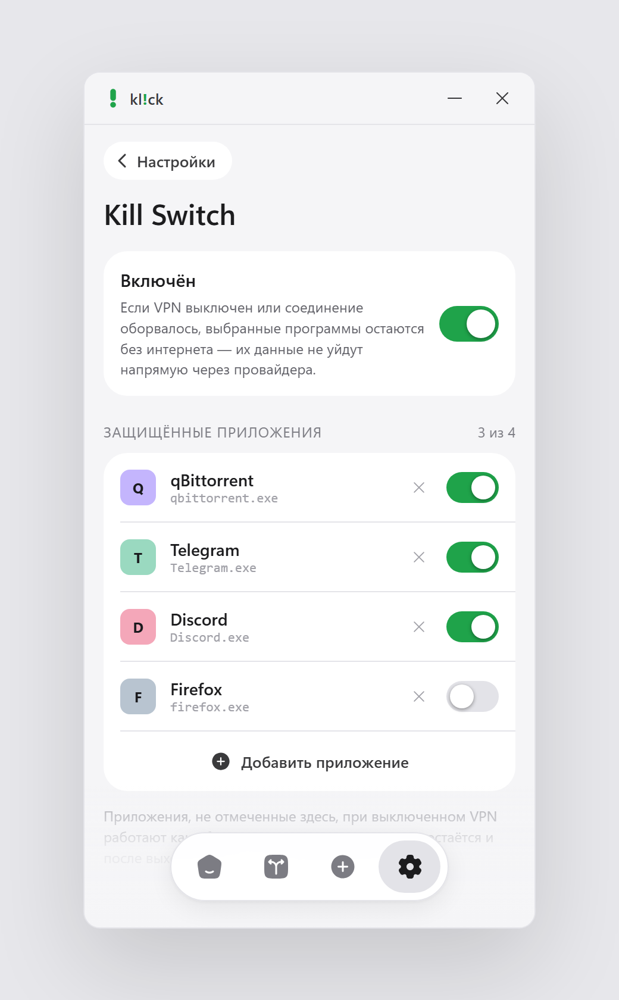
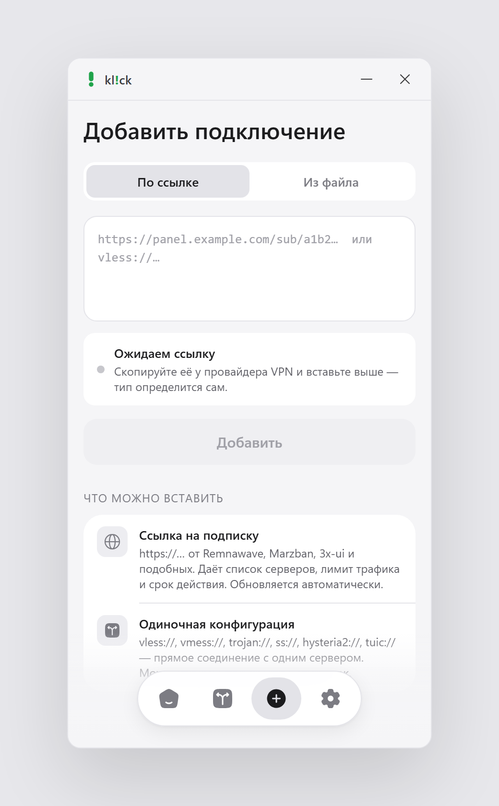
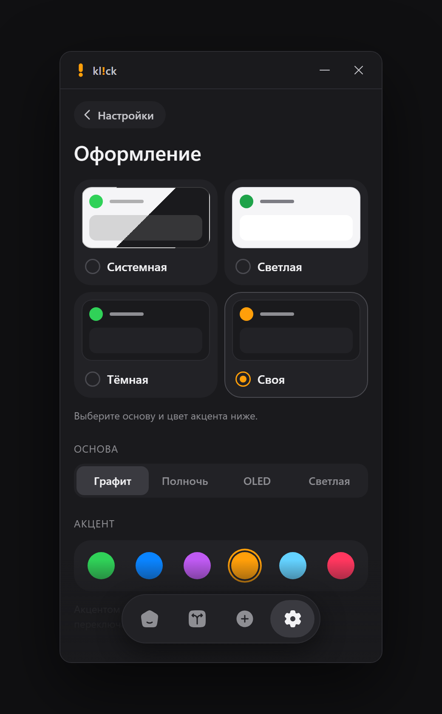

<div align="center">


# kl!ck

**VPN-клиент для Windows на ядре [mihomo](https://github.com/MetaCubeX/mihomo)**

Подписки Remnawave · Marzban · 3x-ui · VLESS/Reality · Hysteria2 · TUIC · Trojan · Shadowsocks

[Скачать](https://github.com/vbu00/klick/releases/latest) · [Что умеет](#что-умеет) · [Сборка](#сборка) · [Лицензия](#лицензия)



</div>

---

kl!ck — небольшое окно 380×720 с одной большой кнопкой. Вставляете ссылку на
подписку — получаете список серверов, остаток трафика и срок действия;
нажимаете кнопку — весь компьютер идёт через VPN. Российские сайты и
локальная сеть по умолчанию остаются напрямую, а отдельные сайты и программы
можно пустить в обход туннеля, всегда через него или заблокировать.

Под капотом — **mihomo** (Clash.Meta): kl!ck собирает для него конфиг, запускает
и следит за ним. Сделан как форк mihomo: ветка `main` этого репозитория —
клиент, ветка [`mihomo`](../../tree/mihomo) — исходники ядра из MetaCubeX/mihomo.

## Скриншоты

<table>
  <tr>
    <td align="center"><br/><sub>Главная · тёмная</sub></td>
    <td align="center"><br/><sub>Главная · светлая</sub></td>
    <td align="center"><br/><sub>Своя тема · «Полночь» + синий</sub></td>
  </tr>
  <tr>
    <td align="center"><br/><sub>Маршрутизация · OLED + фиолетовый</sub></td>
    <td align="center"><br/><sub>Режим подключения</sub></td>
    <td align="center"><br/><sub>Kill Switch по программам</sub></td>
  </tr>
  <tr>
    <td align="center"><br/><sub>Добавление: тип ссылки определяется сам</sub></td>
    <td align="center"><br/><sub>Оформление · 4 основы, 6 акцентов</sub></td>
    <td></td>
  </tr>
</table>

## Что умеет

**Подключения**
- **Подписки** по `https://` — Remnawave, Marzban, 3x-ui и совместимые. Панель
  получает User-Agent `clash-verge` и отдаёт готовый конфиг mihomo со всеми
  тонкостями транспорта; 3x-ui с base64-списком ссылок тоже понимается.
- **Трафик и срок действия** из заголовка `subscription-userinfo`, название —
  из `profile-title`. Подписки обновляются сами: как просит панель
  (`profile-update-interval`) или раз в 12 часов; выбранный сервер при этом
  сохраняется.
- **Одиночные ссылки** `vless://` (TLS, Reality, XTLS Vision), `vmess://`,
  `trojan://`, `ss://` (в т. ч. Shadowsocks 2022 и obfs), `hysteria2://` / `hy2://`,
  `tuic://`, `anytls://`; транспорт ws (с early data), gRPC, h2, httpupgrade,
  xhttp. Несколько строк сразу — одно подключение со списком серверов.
- **Файлы** конфигов mihomo/Clash (`.yaml`, `.yml`, `.json`) — выбором или
  перетаскиванием в окно.

**Серверы**
- Переключение на лету, без переподключения.
- **Настоящая проверка задержки** — URL-тест через сам сервер, а не TCP-пинг.
  Работает и без подключения: kl!ck на секунду поднимает отдельный mihomo без
  TUN и прокси, поэтому честно проверяются и UDP-протоколы (Hysteria2, TUIC).
- Раз в минуту проверяет, что через сервер реально что-то открывается; перестал
  отвечать — уведомление и красная иконка в трее. Упало ядро — три попытки
  переподключиться.

**Режимы**
- **VPN (TUN)** — весь трафик всех программ, включая игры и UDP. Стек gvisor:
  с ним туннель работает и при второй VPN в системе.
- **Системный proxy** — адрес прокси сообщается Windows; при отключении прежние
  настройки прокси возвращаются как были, а не просто выключаются.
- **Proxy** — SOCKS5/HTTP на `127.0.0.1:7890` для программ, настроенных вручную.
- Куда направлять трафик: **по правилам**, **глобально** или **напрямую** —
  переключается на лету.

**Маршрутизация**
- Быстрые исключения одним тумблером: домены `.ru`/`.su`/`.рф` напрямую,
  локальная сеть напрямую, российские IP по базе GeoIP напрямую.
- Свои правила для сайтов (домен со всеми поддоменами, `.ru` — вся зона) и для
  программ (по exe): **через VPN**, **напрямую** или **блок**. Программы
  важнее сайтов. Выбор программ — из запущенных, с сортировкой по сетевой
  активности.
- Правила применяются без переподключения: mihomo перечитывает конфиг на лету.

**Kill Switch по программам**
- Пока VPN выключен или оборвался, отмеченные программы (торрент-клиент,
  мессенджер) остаются без интернета — правило брандмауэра Windows на их exe.
  Остальные работают как обычно. Если правило записать не удалось, kl!ck
  скажет об этом: уведомление, точка на вкладке «Настройки», кнопка «Повторить».

**Прочее**
- Тема: системная, светлая, тёмная или своя — основы «Графит», «Полночь»,
  OLED, светлая и шесть цветов акцента.
- Трей с меню: статус, задержка, переключение сервера, подключить/отключить.
- Запуск с Windows свёрнутым в трей — задачей Планировщика, без запроса UAC.
- Логи ядра с копированием; уведомления об обрывах.

## Установка

1. Скачайте `kl!ck_x.y.z_x64-setup.exe` со страницы [релизов](https://github.com/vbu00/klick/releases/latest).
2. Установите — нужны Windows 10/11 x64 и права администратора (TUN-адаптер и
   правила брандмауэра без них не создать).
3. «Добавить» → вставьте ссылку на подписку → кнопка питания.

Данные хранятся в `%LOCALAPPDATA%\com.vbu00.klick`: `settings.json`,
`profiles.dat` (подключения, зашифрованы DPAPI под вашу учётную запись),
`core\` (конфиг mihomo, GeoIP-база), `mihomo.log`.

**Приватность.** kl!ck ничего не собирает и никуда не отправляет. Сам он ходит
в сеть только за вашими подписками; всё остальное — трафик, который вы
пускаете через mihomo.

## Как устроено

Одно приложение с правами администратора: окно на Tauri 2 (WebView2), логика
на Rust, mihomo — дочерний процесс в Job Object (упадёт kl!ck — Windows
завершит и ядро). Конфиг mihomo собирается из подключения и правил, пишется
JSON-ом (YAML его читает как есть), управление — через REST API mihomo.

| Файл | Что делает |
|---|---|
| `src-tauri/src/links.rs` | ссылки → прокси mihomo, разбор YAML и base64-подписок |
| `src-tauri/src/sub.rs` | скачивание подписок, трафик и срок из заголовков |
| `src-tauri/src/config.rs` | конфиг mihomo: TUN, DNS, группа серверов, правила |
| `src-tauri/src/core.rs` | запуск/остановка ядра, лог, проверка связи, переподключение |
| `src-tauri/src/api.rs` | REST API mihomo: сервер, режим, задержка, перезагрузка, скорость |
| `src-tauri/src/killswitch.rs` | правила брандмауэра на программы |
| `src-tauri/src/sysproxy.rs` | системный прокси с возвратом прежних настроек |
| `src/app.js`, `src/style.css` | окно — все экраны по макету |

## Сборка

Нужны Rust (MSVC), Node.js и PowerShell.

```bash
npm install
npm run core     # mihomo v1.19.31 и country.mmdb — со сверкой sha256
npm run build    # установщик: src-tauri/target/release/bundle/nsis/
```

Ядро и GeoIP-база не хранятся в git: `tools/fetch-core.ps1` скачивает
официальный релиз MetaCubeX/mihomo и базу из MetaCubeX/meta-rules-dat,
привязанную к коммиту, и проверяет контрольные суммы. Чтобы обновить ядро,
поменяйте версию и sha256 в начале скрипта.

Тесты — разбор ссылок, подписок, правил и лога:

```bash
cd src-tauri
cargo test --lib
cargo test --lib mihomo_ -- --ignored   # mihomo сам проверяет собранный конфиг (-t)
```

Вёрстка без Tauri — на тестовых данных: `node .claude/preview-server.js` →
http://localhost:4176/src/mock (`#fail`, `#dead`, `#empty`, `#ksfail` — сценарии
ошибок). Скриншоты этого README снимает `npm run screenshots`, иконки рисует
`python tools/make-icons.py`.

## Лицензия

kl!ck — [MIT](LICENSE). mihomo — тоже MIT (© 2023 KT); GeoIP-база
meta-rules-dat — GPL-3.0, поставляется отдельным файлом без изменений.
Подробности — [THIRD_PARTY_NOTICES.md](THIRD_PARTY_NOTICES.md).

Спасибо [MetaCubeX](https://github.com/MetaCubeX) за mihomo — без него здесь
нечего было бы запускать.
