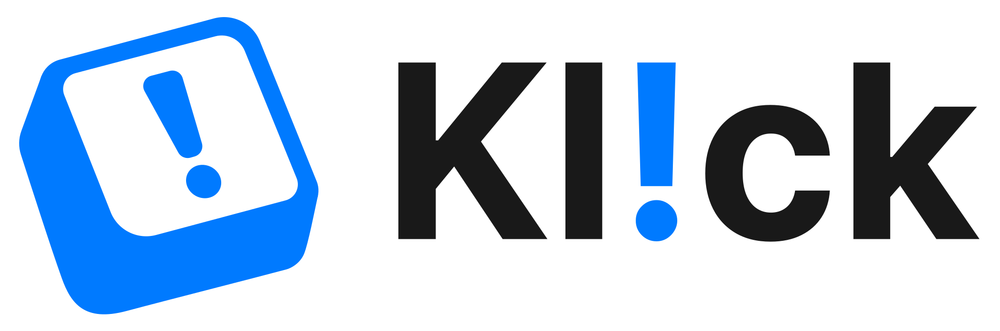
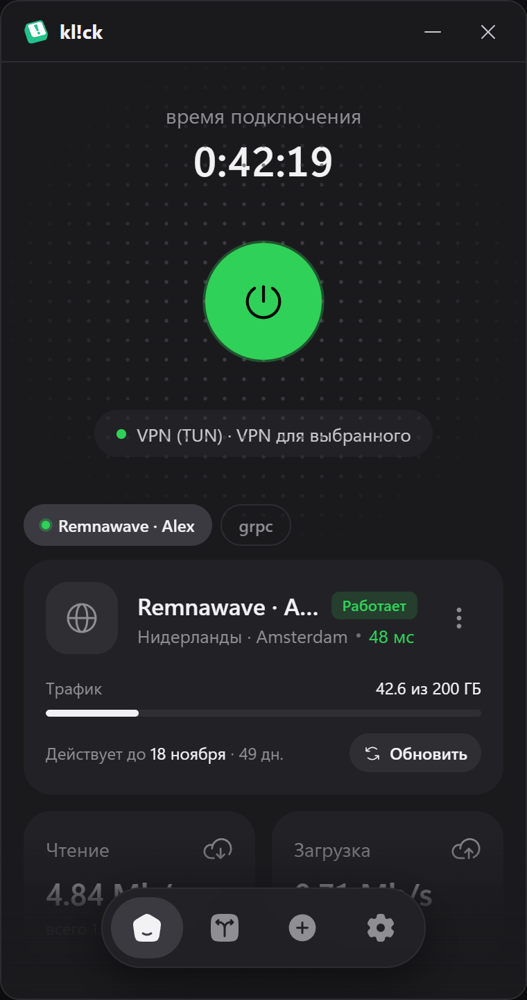
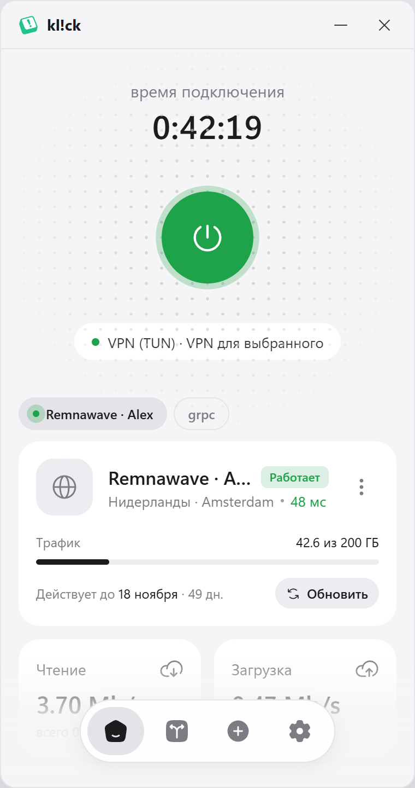
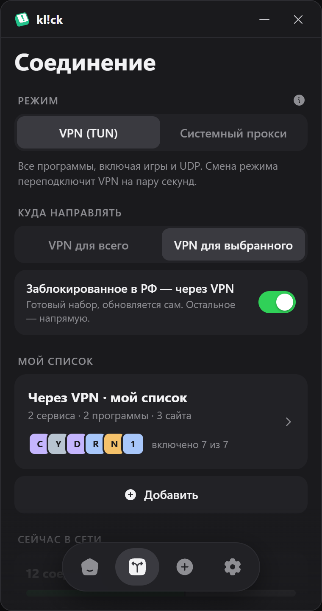
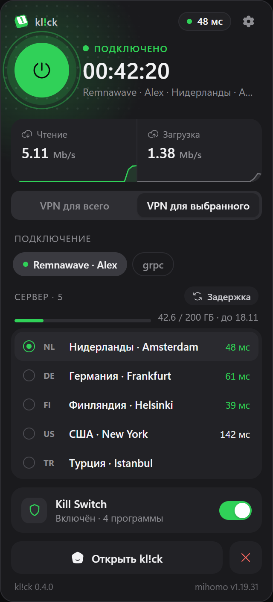
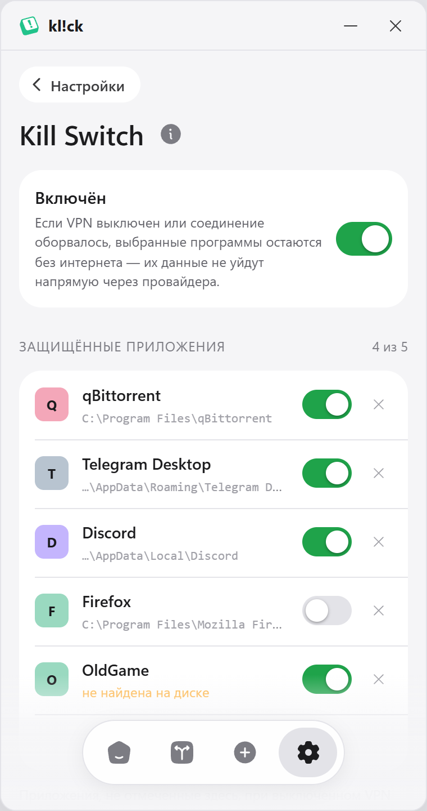
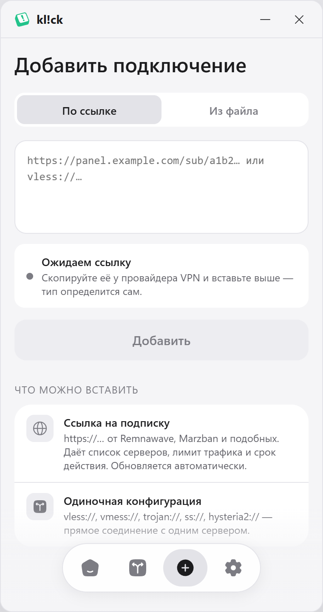

<div align="center">

<picture>
  <source media="(prefers-color-scheme: dark)" srcset="docs/logo/wordmark-dark.svg" />
  
</picture>

**VPN-клиент для Windows и macOS на ядре [mihomo](https://github.com/MetaCubeX/mihomo)**

Подписки Remnawave · Marzban · 3x-ui · VLESS/Reality · Hysteria2 · TUIC · Trojan · Shadowsocks · WireGuard

[Скачать](https://github.com/vbu00/klick/releases/latest) · [Что умеет](#что-умеет) · [Установка](#установка) · [macOS](#macos) · [Сборка](#сборка) · [Авторы](#авторы) · [Лицензия](#лицензия)

</div>

---

kl!ck — небольшое окно с одной большой кнопкой. Вставляете ссылку на
подписку — получаете список серверов, остаток трафика и срок действия;
нажимаете кнопку — компьютер идёт через VPN. Можно пустить через VPN всё,
а можно только выбранное: заблокированные в России сайты, свои программы и
сайты.

VPN держит служба Windows, а не окно: окно работает без прав администратора,
его можно закрыть — VPN и Kill Switch продолжат работать. Под капотом —
**[mihomo](https://github.com/MetaCubeX/mihomo)** от MetaCubeX, официальный
релиз без изменений.

## Скриншоты

<table>
  <tr>
    <td align="center"><br/><sub>Главная</sub></td>
    <td align="center"><br/><sub>Главная · светлая тема</sub></td>
    <td align="center"><br/><sub>Соединение: режим и маршрутизация</sub></td>
  </tr>
  <tr>
    <td align="center"><br/><sub>Окно трея — по правому щелчку</sub></td>
    <td align="center"><br/><sub>Kill Switch</sub></td>
    <td align="center"><br/><sub>Добавить подключение</sub></td>
  </tr>
</table>

## Что умеет

**Подключения**
- **Подписки** по `https://` — Remnawave, Marzban, 3x-ui и совместимые; ответ
  в формате Clash/mihomo (YAML или JSON), sing-box, Xray или списком ссылок.
  Ключи Outline `ssconf://`. Остаток
  трафика и срок действия — из заголовка `subscription-userinfo`; подписки
  обновляются сами (как просит панель или раз в 12 часов), выбранный сервер
  сохраняется.
- **Одиночные ссылки** `vless://` (TLS, Reality), `vmess://`, `trojan://`,
  `ss://`, `hysteria2://` / `hy2://`, `tuic://`, `anytls://`, `wireguard://`,
  `socks5://`. Несколько строк сразу — одно подключение со списком серверов.
- **Файлы**: конфиги mihomo/Clash (YAML и JSON), sing-box и Xray/V2Ray
  (`.json`, в том числе массивы Remnawave), WireGuard и AmneziaWG (`.conf`),
  Shadowsocks SIP008, списки ссылок. Из чужих форматов берутся серверы.
- Кнопка «Добавить в kl!ck» на странице подписки (ссылка `klick://add`)
  открывает kl!ck с уже вставленной подпиской — остаётся нажать «Добавить».
- Предупреждения о конце срока и трафика подписки.

**Серверы**
- Переключение на лету, без переподключения.
- Задержка — настоящий запрос через сервер, а не пинг; меряется и при
  выключенном VPN.
- Если сервер перестал отвечать: переподключиться и ждать, перейти на
  следующий рабочий или всегда держаться самого быстрого — на выбор.
- После смены сети и пробуждения компьютера связь проверяется сразу.

**Режимы**
- **VPN (TUN)** — весь трафик всех программ, включая игры и UDP.
- **Системный прокси** — для браузеров и программ, которые понимают
  системный прокси. Прежние настройки прокси возвращаются как были, в том
  числе после выключения компьютера.
- Если рядом работает то, что мешает VPN (zapret, GoodbyeDPI, другой
  VPN-клиент), kl!ck предупредит.

**Куда направлять**
- **VPN для всего** — через VPN идёт всё; российские сайты и адреса можно
  пустить напрямую переключателями.
- **VPN для выбранного** — через VPN только нужное: готовый набор
  «Заблокированное в РФ» (встроенный список плюс общий список сообщества
  [itdoginfo/allow-domains](https://github.com/itdoginfo/allow-domains),
  обновляется раз в сутки) и ваш список. Остальное — напрямую.
- В свой список добавляются сервисы из каталога, программы, сайты и IP.
  Правило можно выключить, не удаляя.
- Локальная сеть — роутер, принтер, NAS — всегда напрямую.

**Соединение** — отдельная вкладка
- **Сейчас в сети:** какие программы куда ходят — через VPN или напрямую, —
  и тумблер у каждой, чтобы поменять.
- **Не открывается?** — неудачные соединения и причина.
- **Как вас видят сайты** — IP, страна и провайдер через VPN и напрямую,
  утечки DNS и IPv6.
- Живая схема: что сейчас идёт через VPN, что напрямую.

**Kill Switch**
- Отмеченные программы не выйдут в интернет мимо VPN: пока VPN выключен или
  оборвался, у них нет сети. Работает на уровне фильтров Windows (WFP),
  держится и без службы, и после перезагрузки.
- Локальная сеть для них открыта.
- Программа обновилась в новую папку или пропала — kl!ck заметит.

**Трей**
- Значок — клавиша цвета состояния: синяя — подключаюсь, зелёная —
  подключено, оранжевая — сервер не отвечает, красная — ошибка, серая —
  выключено.
- **Левый щелчок** — главное окно. **Правый** — окно трея: кнопка, скорость,
  «VPN для всего / для выбранного», подключения, серверы с задержкой,
  Kill Switch, выход.
- Уведомления Windows об обрывах и восстановлении связи.

**Прочее**
- Темы: системная, светлая, тёмная или своя — основы «Графит», «Полночь»,
  OLED, светлая и шесть цветов акцента.
- Запуск с Windows свёрнутым в трей; «Восстанавливать подключение» после
  перезагрузки.
- Журнал службы и отчёт для поддержки — без адресов сайтов и серверов.
- «О приложении»: версии, проверка обновлений на GitHub.

## Установка

1. Скачайте `klick-x.y.z-x64-setup.exe` со страницы [релизов](https://github.com/vbu00/klick/releases/latest).
2. Запустите — нужны Windows 10/11 x64 и один раз права администратора: они
   нужны, чтобы поставить службу. Если нет WebView2 Runtime, установщик
   поставит его сам.
3. «Добавить» → вставьте ссылку на подписку → кнопка питания.

Прежнюю kl!ck установщик найдёт сам, перенесёт подписки и удалит её.

Данные — в `C:\ProgramData\klick`: настройки, подписки (ссылки зашифрованы
DPAPI), журнал. Папка закрыта от обычных пользователей и программ.

**Приватность.** kl!ck ничего не собирает и никуда не отправляет. Сам он
ходит в сеть за вашими подписками, раз в сутки — за списком
«Заблокированное в РФ» (GitHub, через VPN), при установке — за WebView2
Runtime (Microsoft), если его нет; по кнопке — за проверкой IP (ipify.org,
proxycheck.io) и номером последней версии (GitHub API).

## macOS

kl!ck работает и на macOS 12+ (Apple Silicon и Intel) — то же окно, та же служба и те же функции;
Kill Switch — брандмауэром pf. Пакет пока не подписан сертификатом Apple, поэтому ставится из
Терминала (`installer` ставит его без вопроса Gatekeeper):

```sh
curl -fL -o /tmp/klick.pkg https://github.com/vbu00/klick/releases/latest/download/klick-macos.pkg
sudo installer -pkg /tmp/klick.pkg -target /
open -a 'kl!ck'
```

Пакет ставит окно в «Программы» и службу (демон launchd `app.klick.service`); данные — в
`/Library/Application Support/klick`. Обновление — те же команды: служба перезапустится и, если VPN
был включён, включит его снова. Пути с `kl!ck` в zsh пишите в **одинарных** кавычках.

```sh
'/Applications/kl!ck.app/Contents/MacOS/klick-cli' --prod status      # состояние VPN
sudo '/Applications/kl!ck.app/Contents/Resources/uninstall.sh'        # удалить (подключения и настройки остаются)
sudo '/Applications/kl!ck.app/Contents/Resources/uninstall.sh' --wipe # удалить всё
```

Как устроен порт и чем macOS отличается от Windows — в [docs/macos-port.md](docs/macos-port.md).

## Сборка

Нужны Rust (stable, MSVC), Node.js 20.19+ и PowerShell.

```powershell
cd ui; npm install; cd ..
powershell -ExecutionPolicy Bypass -File build.ps1   # dist\klick-setup.exe
```

На Mac (Xcode Command Line Tools, Rust, Node.js 20.19+):

```sh
scripts/macos/build.sh             # dist/kl!ck.app и dist/klick-<версия>.pkg (universal)
```

Ядро mihomo и база стран в git не хранятся: `build.ps1` скачивает
официальный релиз и проверяет sha256 (`tools\fetch-core.ps1`), на Mac — `scripts/macos/fetch-core.sh`.
Как устроены исходники, служба для разработки, превью окна и проверка в
Песочнице Windows — в [docs/DEVELOPMENT.md](docs/DEVELOPMENT.md).
Скриншоты для README снимает `npm run screenshots`, видеоинструкцию — `npm run video`
(GIF — `npm run video:gif`) в папке `ui`.

## Авторы

- [**vbu00**](https://github.com/vbu00) — разработка
- [**Dmitriy Medvedev**](https://github.com/aleuuu) — дизайн интерфейса и логотип
- [**limeflash**](https://github.com/limeflash) — порт на macOS

Логотип-клавиша в пяти цветах и вордмарк — в [`docs/logo`](docs/logo).

## Лицензия

kl!ck — [MIT](LICENSE). mihomo — GPL-3.0, поставляется отдельным файлом
без изменений. Подробности — [THIRD_PARTY_NOTICES.md](resources/licenses/THIRD_PARTY_NOTICES.md).

Спасибо [MetaCubeX](https://github.com/MetaCubeX) за mihomo.
